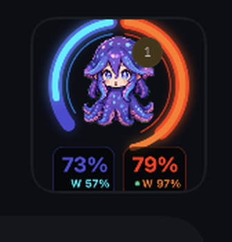

# Codex Pet Meter



A small macOS menu bar app that places a live usage meter around the Codex pet.

It can show Codex and Claude usage together, with separate session and weekly indicators. The overlay follows the pet automatically and does not modify `Codex.app`.

## Features

- Ring or pulse display modes
- Combined, Codex-only, or Claude-only usage
- Session and weekly percentages, with hover details
- 5-hour or 7-day reset indicator
- Custom colors for Codex, Claude, weekly, and reset lines
- Local-only usage reading; OpenUsage is not required

## Install

Requirements:

- macOS 13+
- Node.js 20+
- Xcode Command Line Tools
- Codex desktop app signed in
- Claude Code signed in, if you want Claude usage

```bash
git clone https://github.com/rain2day/codex-pet-meter.git
cd codex-pet-meter
./setup.sh
```

The app is installed to:

```text
~/Applications/Codex Pet Meter.app
```

## Menu

Use the menu bar icon to change:

- Display Mode: `Pulse motion` or `Ring only`
- Data: `Combined`, `Codex`, `Claude`, used/left, and reset window
- Colors: provider session, weekly, and reset colors

Useful commands:

```bash
node install.mjs start
node install.mjs status
node install.mjs uninstall
```

## Data And Privacy

The app reads local Codex and Claude credentials already stored on your Mac, then stores only a small local usage cache and your UI settings.

It does not patch Codex, install a background service, or require OpenUsage.

## Troubleshooting

If the meter does not appear, make sure the Codex pet is visible.

If usage is missing, sign in again to the relevant tool:

```bash
codex login
claude
```

Log:

```bash
tail -f /tmp/codex-usage-halo.log
```

## License

MIT. This project is not affiliated with OpenAI or Anthropic.
